# Lietuviškų klaviatūros išdėstymų palyginimas

  __[ŪĖYOQJ Ratisė](https://albuck.github.io/Ratise-layout/):__

   

  __[QGRLDČ Lekp](https://lekp.info/):__

   

  __[ĄŽERTY Standard 2000](http://www.ims.mii.lt/klav/):__

   

  __[ĄŽERTY Standard 1992 (IBM)](https://www.registrucentras.lt/litwin/keyboard.html):__

   

  __[QWERTY Baltic-Numeric](https://www.registrucentras.lt/litwin/keyboard.html):__

   

+ Išdėstymai rikiuojami pagal pasiekimus išdėstymų našumo patikroje.

Čia naudotasi puikiu žiniatinklio ištekliu: [Keyboard Layout Analyzer](http://patorjk.com/keyboard-layout-analyzer/#/main), kur išdėstymo našumas-patogumas matuojamas taškais. Skaičiuojant taškus atsižvelgiama į pirštų nueinamą atstumą (33%), kaip dažnai tam pačiam pirštui tenka iš eilės spaudinėti (33%), bei kaip dažnai spausdinant kaitaliojami pirštai (17%) ir rankos (17%).

__Pastabos.__ Patikroje septintas viršutinis mygtukas (QWERTY skaičių eilėje ‘6’) priskirtas kairiajam smiliui ir vienuoliktas (QWERTY ‘0’) dešiniajam bevardžiui, klaviatūrose su skersuotais mygtukais taip patogiau; taip pat perskirtose klaviatūrose tas septintas mygtukas paprastai būna kairėje pusėje. Perpaskyrus, kaip įprastai turėtų būti, patikros taškai gali nežymiai skirtis. Išdėstymuose patikroje yra suvienodinti ilgieji brūkšniai. Senesni išdėstymai (AŽERTY IBM ir QWERTY Baltic-Numeric) papildyti keliais spaudais (žali).

+ __Duomenų pateikimo pavidalas:__ „Pirmenybė“. „Išdėstymas“ — „išdėstymo įvertinimo taškai“

## Lietuviško teksto skaidymas:

+ [Keyboard Layout Analyzer: Lietuviškų dažnų žodžių šimtukas](http://patorjk.com/keyboard-layout-analyzer/#/load/PsJMFvbs)

   1. __ŪĖYOQJ Ratise (ISO) — 76.16__
   2. QGRLDČ LEKP (ISO) — 69.00
   3. AŽERTY LT Standard 2000 (ISO) — 58.80
   4. AŽERTY IBM, LT Standard 1992 (ISO) — 58.56
   5. QWERTY Baltic-Numeric (ISO) — 57.39

+ [Keyboard Layout Analyzer: Paprasti rašiniai](http://patorjk.com/keyboard-layout-analyzer/#/load/wztGknfd)

   1. __ŪĖYOQJ Ratise (ISO) — 71.55__
   2. QGRLDČ LEKP (ISO) — 62.81
   3. AŽERTY LT Standard 2000 (ISO) — 50.21
   4. AŽERTY IBM, LT Standard 1992 (ISO) — 50.04
   5. QWERTY Baltic-Numeric (ISO) — 48.53

+ [Keyboard Layout Analyzer: Jonas Biliūnas „Brisiaus galas“](http://patorjk.com/keyboard-layout-analyzer/#/load/1JlsgLkr)

   1. __ŪĖYOQJ Ratise (ISO) — 69.24__
   2. QGRLDČ LEKP (ISO) — 60.05
   3. AŽERTY LT Standard 2000 (ISO) — 49.10
   4. AŽERTY IBM, LT Standard 1992 (ISO) — 48.46
   5. QWERTY Baltic-Numeric (ISO) — 46.89

+ [Keyboard Layout Analyzer: Vincas Krėvė „Skerdžius“](http://patorjk.com/keyboard-layout-analyzer/#/load/CHbQHQnd)

   1. __ŪĖYOQJ Ratise (ISO) — 68.20__
   2. QGRLDČ LEKP (ISO) — 59.35
   3. AŽERTY LT Standard 2000 (ISO) — 47.99
   4. AŽERTY IBM, LT Standard 1992 (ISO) — 47.53
   5. QWERTY Baltic-Numeric (ISO) — 46.13

+ [Keyboard Layout Analyzer: Lietuvių padavimai](http://patorjk.com/keyboard-layout-analyzer/#/load/q1kP7h2b)

   1. __ŪĖYOQJ Ratise (ISO) — 67.70__
   2. QGRLDČ LEKP (ISO) — 60.51
   3. AŽERTY LT Standard 2000 (ISO) — 48.34
   4. AŽERTY IBM, LT Standard 1992 (ISO) — 47.87
   5. QWERTY Baltic-Numeric (ISO) — 45.20

+ [Keyboard Layout Analyzer: Lietuviškos pasakos (iš Basanavičiaus rinkinio)](http://patorjk.com/keyboard-layout-analyzer/#/load/2X1jFvVl)

   1. __ŪĖYOQJ Ratise (ISO) — 67.42__
   2. QGRLDČ LEKP (ISO) — 58.00
   3. AŽERTY LT Standard 2000 (ISO) — 47.28
   4. AŽERTY IBM, LT Standard 1992 (ISO) — 46.81
   5. QWERTY Baltic-Numeric (ISO) — 44.21

+ [Keyboard Layout Analyzer: Vikipedijos straipsnis „Fizika“](http://patorjk.com/keyboard-layout-analyzer/#/load/3g4Rj0Lx) (pataisyti ilgieji brūkšniai)

   1. __ŪĖYOQJ Ratise (ISO) — 67.06__
   2. QGRLDČ LEKP (ISO) — 60.25
   3. AŽERTY IBM, LT Standard 1992 (ISO) — 45.40
   4. QWERTY Baltic-Numeric (ISO) — 45.20
   5. AŽERTY LT Standard 2000 (ISO) — 45.17

+ [Keyboard Layout Analyzer: Vikipedijos straipsnis „Mokykla“](http://patorjk.com/keyboard-layout-analyzer/#/load/ZxzZwNSc) (pataisyti ilgieji brūkšniai bei keletas klaidų)

   1. __ŪĖYOQJ Ratise (ISO) — 65.16__
   2. QGRLDČ LEKP (ISO) — 57.55
   3. AŽERTY IBM, LT Standard 1992 (ISO) — 42.40
   4. AŽERTY LT Standard 2000 (ISO) — 41.62
   5. QWERTY Baltic-Numeric (ISO) — 41.15

+ [Keyboard Layout Analyzer: Vikipedijos straipsnis „Lietuva“](http://patorjk.com/keyboard-layout-analyzer/#/load/DfQBPDQT) (pataisyti ilgieji brūkšniai)

   1. __ŪĖYOQJ Ratise (ISO) — 61.29__
   2. QGRLDČ LEKP (ISO) — 53.98
   3. AŽERTY LT Standard 2000 (ISO) — 41.61
   4. AŽERTY IBM, LT Standard 1992 (ISO) — 41.10
   5. QWERTY Baltic-Numeric (ISO) — 41.00

+ [Keyboard Layout Analyzer: Eglė Žalčių karalienė, Salomėja Nėris (pasaka-poema)](http://patorjk.com/keyboard-layout-analyzer/#/load/gvnL8tdm)

   1. __ŪĖYOQJ Ratise (ISO) — 55.97__ (72.24)
   2. QGRLDČ LEKP (ISO) — 44.71 (65.20)
   3. AŽERTY IBM, LT Standard 1992 (ISO) — 36.63 (52.92)
   4. AŽERTY LT Standard 2000 (ISO) — 36.58 (53.36)
   5. QWERTY Baltic-Numeric (ISO) — 36.44 (49.86)

   - Skliaustuose — [šio teksto vienų žodžių skaičiai](http://patorjk.com/keyboard-layout-analyzer/#/load/m0185zS4).

_Žemiau pateikiami paveikslėliai su išdėstymų mygtukų naudojimo dažnumu spausdinant lietuvišką tekstą. Ryškesnė spalva rodo didesnį mygtuko naudojimo dažnumą._

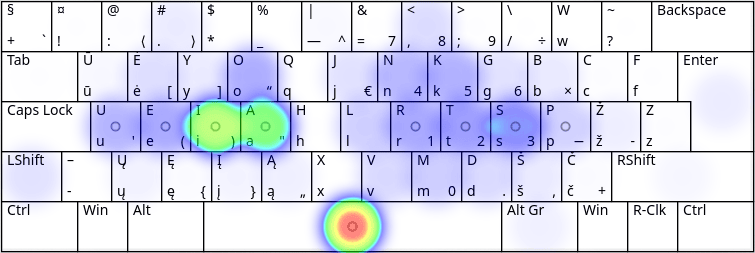

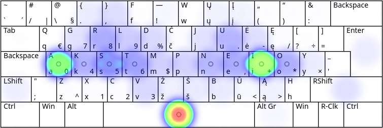

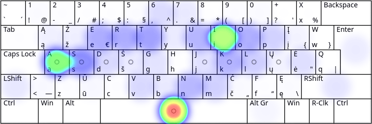

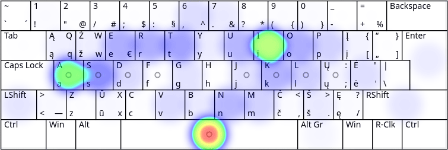

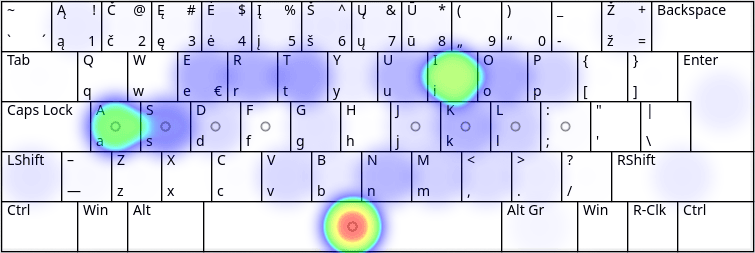

## Angliško teksto skaidymas:

+ [Keyboard Layout Analyzer: List of the most commonly used words](http://patorjk.com/keyboard-layout-analyzer/#/load/60BnXQgk)

   1. __ŪĖYOQJ Ratise (ISO) — 66.90__
   2. QGRLDČ LEKP (ISO) — 66.73
   3. QWERTY Baltic+ (ISO) — 49.04
   4. AŽERTY IBM, LT Standard 1992 (ISO) — 47.67
   5. AŽERTY LT Standard 2000 (ISO) — 46.72

+ [Keyboard Layout Analyzer: Wikipedia “Physics”](http://patorjk.com/keyboard-layout-analyzer/#/load/RV8H0NNW)

   1. __ŪĖYOQJ Ratise (ISO) — 63.59__
   2. QGRLDČ LEKP (ISO) — 58.91
   3. QWERTY Baltic-Numeric (ISO) — 47.45
   4. AŽERTY IBM, LT Standard 1992 (ISO) — 44.89
   5. AŽERTY LT Standard 2000 (ISO) — 42.70

+ [Keyboard Layout Analyzer: Alice in Wonderland, Chapter 1](http://patorjk.com/keyboard-layout-analyzer/#/load/QPM17nf2)

   1. __Ratise (ISO) — 62.38__
   2. QGRLDČ LEKP (ISO) — 60.28
   3. QWERTY Baltic-Numeric (ISO) — 52.89
   4. AŽERTY IBM, LT Standard 1992 (ISO) — 48.91
   5. AŽERTY LT Standard 2000 (ISO) — 47.08

+ [Keyboard Layout Analyzer: “Scientific Papers”](http://patorjk.com/keyboard-layout-analyzer/#/load/08tpxbgP)

   1. __ŪĖYOQJ Ratise (ISO) — 58.91__
   2. QGRLDČ LEKP (ISO) — 58.41
   3. QWERTY Baltic-Numeric (ISO) — 43.25
   4. AŽERTY IBM, LT Standard 1992 (ISO) — 40.79
   5. AŽERTY LT Standard 2000 (ISO) — 38.98

  __Pastaba:__ kai kuriuose papildomai bandytuose angliškuose tekstuose _LEKP_ pasirodo kartais kiek geriau nei _Ratisė_.
  
  _Žemiau pateikiami paveikslėliai su išdėstymų mygtukų naudojimo dažnumu spausdinant anglišką tekstą. Ryškesnė spalva rodo didesnį mygtuko naudojimo dažnumą._

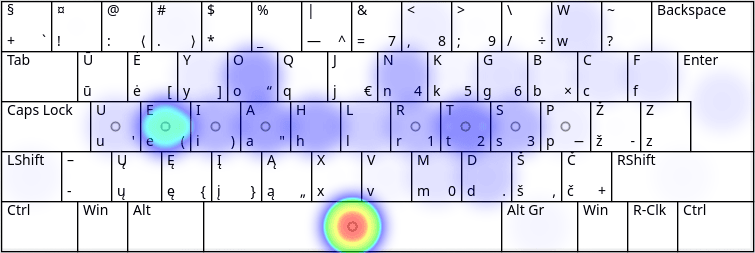

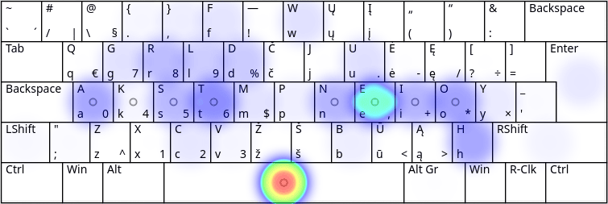

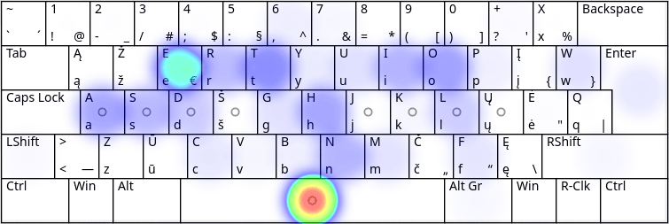

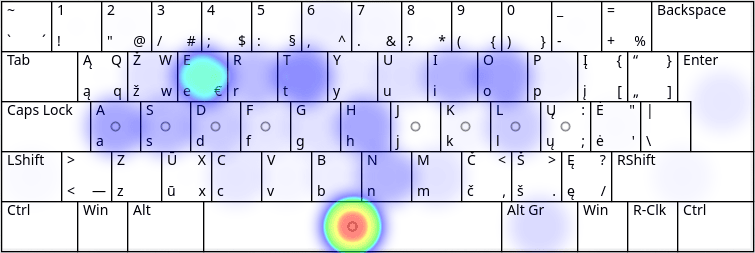

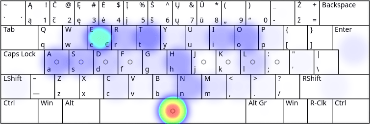

## Programavimo kalbų teksto skaidymas:

+ [Keyboard Layout Analyzer: ‘Programming Punctuation Torture Test’](http://patorjk.com/keyboard-layout-analyzer/#/load/V2Qmj2hB)

   1. __ŪĖYOQJ Ratise (ISO) — 46.95__
   2. QGRLDČ LT Standard 2000 (ISO) — 34.29
   3. AŽERTY IBM, LT Standard 1992 (ISO) — 33.10
   3. QWERTY Baltic-Numeric (ISO) — 22.23
   4. QGRLDČ LEKP (ISO) — 22.14

+ [Keyboard Layout Analyzer: ‘Bash, C, CPP, HTML, JavaScript, Python’](http://patorjk.com/keyboard-layout-analyzer/#/load/t2XQJPcd)

   1. __ŪĖYOQJ Ratise (ISO) — 45.38__
   2. QGRLDČ LEKP (ISO) — 40.70
   3. QWERTY Baltic-Numeric (ISO) — 34.13
   4. AŽERTY IBM, LT Standard 1992 (ISO) — 33.88
   5. AŽERTY LT Standard 2000 (ISO) — 33.34

_Žemiau pateikiami paveikslėliai su išdėstymų mygtukų naudojimo dažnumu spausdinant ‘Bash, C, CPP, HTML, JavaScript, Python’ tekstą. Ryškesnė spalva rodo didesnį mygtuko naudojimo dažnumą._

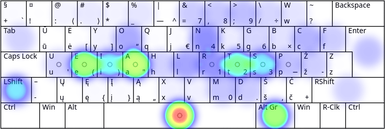

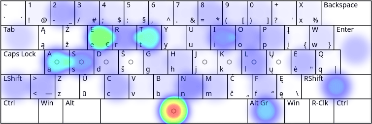

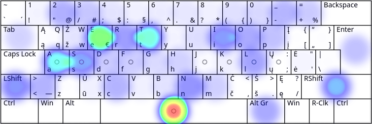

## Lotyniško teksto „Lorem Ipsum“ skaidymas:

+ [Keyboard Layout Analyzer: Lorem Ipsum](http://patorjk.com/keyboard-layout-analyzer/#/load/Dx3GlBwx)

   1. __ŪĖYOQJ Ratise (ISO) — 70.69__
   2. QGRLDČ LEKP (ISO) —  	67.92
   3. QWERTY Baltic-Numeric (ISO) — 48.67
   4. AŽERTY IBM, LT Standard 1992 (ISO) — 46.36
   5. AŽERTY LT Standard 2000 (ISO) — 46.24

## Išvados:

+ Iš visų aukščiau tikrintų klaviatūros išdėstymų, _ŪĖYOQJ Ratisės_ išdėstymas geriausiai tinka lietuvių, anglų bei programavimo kalbų [tekstams rinkti visais pirštais („Aklasis teksto rinkimas“)](https://albuck.github.io/Ratise-layout/docs/spausdinimo-visais-pirstais-tvarka.html), t. y. su _Ratise_ atliksite tą patį darbą patogiau ir lengviau negu su kitais išdėstymais.
+ _AŽERTY LT Standard 2000_, _AŽERTY IBM (LT Standard 1992)_ ir _QWERTY Baltic-Numeric_ išdėstymuose dažnai dažniau reikalingi ženklai išdėstyti toliau nuo pagrindinės pirštų padėties, daug dažniau kai kuriems pirštams tenka iš eilės spaudinėti vėl mygtukus, pirštai nueina didesnį atstumą spausdindami. Ženklai šiuose išdėstymuose išdėstyti netvarkingai: visiškai neatsižvelgta nei į pirštų pajėgumą, nei į teksto rinkimo ritmą, nei į raidžių dažnumą ir eiliškumą žodžiuose. Šie išdėstymai yra patys nepatogiausi teksto rinkimui visais pirštais.

__Pastabos.__ Vadinamieji išdėstymai _Lithuanian [Baltic](https://www.registrucentras.lt/litwin/kbdltb.gif), [Numeric/Skaičiukinis](https://www.registrucentras.lt/litwin/kbdlt1.gif), [Skaičiukinis pagerintas](https://rimas.kudelis.lt/numeric/), [LEKP Baltic+](https://lekp.info/images/baltic+.jpg)_ yra vienas ir tas pats išdėstymas su [mažai reikšmingais patikrai skirtumais](http://patorjk.com/keyboard-layout-analyzer/#/load/BWsjctw1), manasis, ko gero, netgi geresnis patikrai (nes turi papildomą ilgąjį brūkšnį ir lietuviškas kabutes pirmame lygyje). _Lithuanian Standard_ arba _Lietuviška standartinė klaviatūra_ turi du valstybinius standartus (LST 1582:2000 ir LST 1582:2012), senu įpratimu rašau _LT Standard 2000_, abiejų standartų išdėstymai nesiskiria vienas nuo kito. ‘Programming Punctuation Torture Test’ paimtas [stevep99 puslapio](https://stevep99.github.io/keyboard-layout-analyzer/#/main).

### Kiti išdėstymų privalumai:

+ _Ratisės_ išdėstymas turi tvarkingai išdėstytus ženklus, todėl yra lengviau ir greičiau įsimenamas.
+ _Ratisės_ išdėstymas turi uždėtinius priegaidžių ženklelius ir kirčiuotas lietuviškas raides (per tęsties lygius).
+ _Ratisės_ išdėstymas turi daugiau papildomų rašto ženklų.
+ _Ratisės_ išdėstymu galima įvesti kitų Europos kalbų raides (per tęsties lygius).
+ _Ratisė_ ir _LEKP_ yra pritaikyti teksto rinkimui visais pirštais, nežiūrint į klaviatūrą.
+ _Baltic-Numeric_ raidės sutampa su angliškojo _QWERTY_ raidėmis, kurios dažniausiai ir būna užpaišytos and pačių klaviatūrų mygtukų, kas yra labai patogu naujokui susiieškoti klaviatūroje tas raides. (Reik manyti, tai yra pagrindinė priežastis, kodėl šis išdėstymas išplito pas mus ir vis dar yra labiausiai naudojamas.)
+ _Baltic-Numeric_ išdėstymas yra visur platinamas ir žinomas, kaip numatytasis „Lithuanian/Lietuvių“.
+ _Lithuanian Standard 2000_ išdėstymas yra platinamas valstybinės įstaigos.
+ _Baltic-Numeric_ išdėstymo ženklai dažnai būna papildomai užžymėti ant Lietuvoje parduodamų klaviatūrų.
+ _Baltic-Numeric_ išdėstymas yra pritaikytas labiau spausdinti vienu/dviem/keliais pirštais žiūrint į klaviatūrą ir ieškant, kur kokia yra raidė.
+ _Baltic-Numeric_ ir _Lithuanian Standard 2000_ išdėstymų paprastai nereikia papildomai įdieginėti.

-----------------------------------------

[Pagrindinių lietuviškų klaviatūros išdėstymų palyginamosios statistinės lentelės](lt-isdestymu-statistines-lenteles.md)

[Tolimesnis lietuviškos kompiuterio klaviatūros tobulinimas ir nauraštis](lietuviskos-klaviaturos-tobulinimas.md)

[Lietuviškas ergonomiškas klaviatūros išdėstymas Ratisė](https://albuck.github.io/Ratise-layout/)

[Klaviatūros valdymo mygtukų ženkliukai ir jų pavadinimai](https://albuck.github.io/Ratise-layout/docs/klaviaturos-valdymo-mygtukai.html)

[Spausdinimo visais pirštais tvarka („Aklasis“ teksto rinkimas)](https://albuck.github.io/Ratise-layout/docs/spausdinimo-visais-pirstais-tvarka.html)
