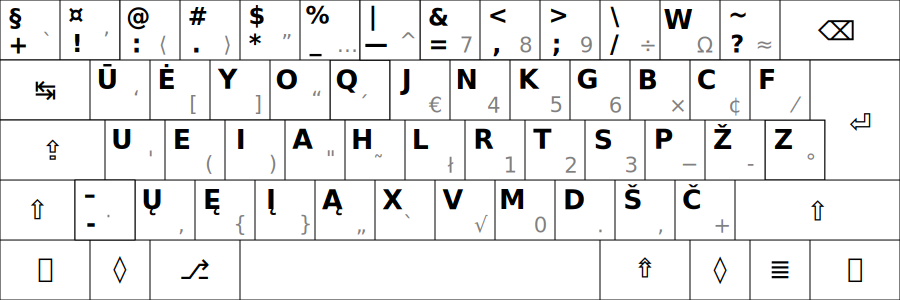
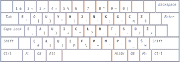
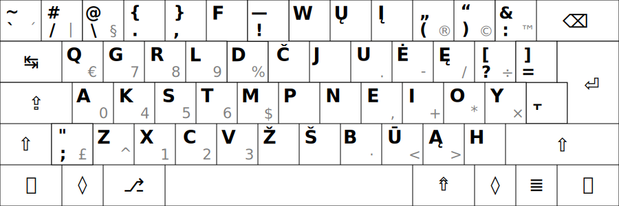
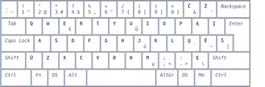
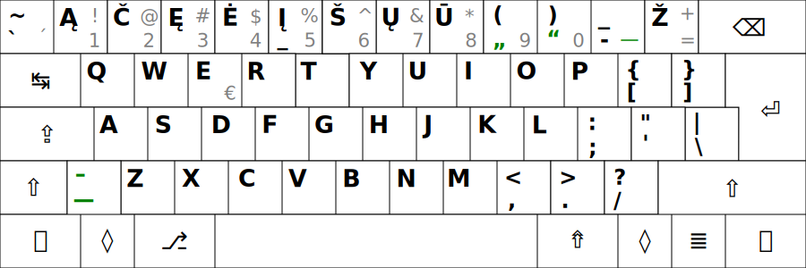
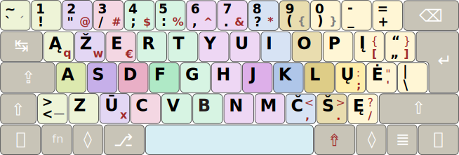
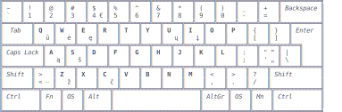
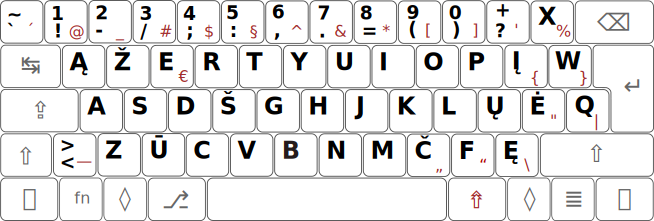
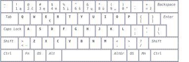

# Lietuviškų klaviatūros išdėstymų palyginimas

+ Išdėstymai rikiuojami pagal visose patikrose (žemiau) surinktų skaičių sumos didumą.

  __1. [ŪĖYOQJ Ratisė](https://albuck.github.io/Ratise-layout/) (ISO):__
   
       NP — V100% L100% E100% P100%(‡)
   
  __2. [ĖOŪYHJ Remigijaus](https://web.archive.org/web/20080315055411/http://pradmenes.net/tekstu_katalogas/remigijus/klaviatura.html) (ISO):__
   
       NP — V92% L93% E91% P93%

  __3. [QGRLDČ Lekp](https://lekp.info/) (ISO):__
   
       NP — V89% L88% E97% P70%

  __4. [FZVPUJ, LST 1092-89](http://lietuvybė.lt/standartai/klaviat%C5%ABros-i%C5%A1d%C4%97stymai/) (ISO):__
   
       NP — V74% L70% E80% P82%
 
  __5. [QWERTY Lithuanian](https://www.registrucentras.lt/litwin/keyboard.html) (ISO):__
   
       NP — V72% L70% E77% P75%
  
  __6. [QWERTY Baltic-Numeric](https://www.registrucentras.lt/litwin/keyboard.html) (ISO):__
   
       NP — V71% L69% E78% P61%

  __7. [ĄŽERTY IBM Standard 1992](https://www.registrucentras.lt/litwin/keyboard.html) (ISO):__
   
       NP — V70% L69% E73% P73%
 
  __8. [QWERTY Lithuanian Programmers](https://www.registrucentras.lt/litwin/keyboard.html) (ISO):__
   
       NP — V70% L68% E78% P57%
  
  __9. [ĄŽERTY Standard 2000](http://www.ims.mii.lt/klav/) (ISO):__
   
       NP — V70% L70% E70% P75%
    
  __10. [QWERTY Baltic-Numeric Programmers](http://lietuvybė.lt/naudotojams/klaviaturos/) (ISO):__
   
       NP — V69% L66% E78% P57%

‡ NP (našumas-patogumas, ergonomiškumas) išreikštas nuošimčiais, lyginant išdėstymų surinktų taškų sumą su geriausiai pasirodžiusiujo išdėstymo (Ratisės) taškų suma, nuošimtis su priešdėliu ‘V’ rodo skaičiavimą visiems bendrai skaičiams, nuošimtis su priešdėliu ‘L’ rodo skaičiavimą tik lietuviškam tekstui, nuošimtis su priešdėliu ‘E’ — tik angliškam, su ‘P’ — tik programavimo tekstui.

+ __Lietuviškų išdėstymų NP vertinimo eilė lietuviškam tekstui:__
 
   1. ŪĖYOQJ Ratisė (ISO) — 100%
   2. ĖOŪYHJ Remigijaus (ISO) — 93%
   3. QGRLDČ LEKP (ISO) — 88%
   4. FZVPUJ (ISO) — 70%
   5. QWERTY Lithuanian (ISO) — 70%
   6. AŽERTY LT Standard 2000 (ISO) — 70%
   7. AŽERTY IBM, LT Standard 1992 (ISO) — 69%
   8. QWERTY Baltic-Numeric (ISO) — 69%
   9. QWERTY Lithuanian Programmers (ISO) — 68%
   10. QWERTY Baltic-Numeric Programmers (ISO) — 66%

+ __Lietuviškų išdėstymų NP vertinimo eilė angliškam tekstui:__
 
   1. ŪĖYOQJ Ratisė (ISO) — 100%
   2. QGRLDČ LEKP (ISO) — 97%
   3. ĖOŪYHJ Remigijaus (ISO) — 91%
   4. FZVPUJ (ISO) — 80%
   5. QWERTY Lithuanian Programmers (ISO) — 78%
   6. QWERTY Baltic-Numeric Programmers (ISO) — 78%
   7. QWERTY Baltic-Numeric (ISO) — 78%
   8. QWERTY Lithuanian (ISO) — 77%
   9. AŽERTY IBM, LT Standard 1992 (ISO) — 73%
   10. AŽERTY LT Standard 2000 (ISO) — 70%

+ __Lietuviškų išdėstymų NP vertinimo eilė programavimo tekstui:__

   1. ŪĖYOQJ Ratisė (ISO) — 100%
   2. ĖOŪYHJ Remigijaus (ISO) — 93%
   3. FZVPUJ (ISO) — 82%
   4. QWERTY Lithuanian (ISO) — 75%
   5. AŽERTY LT Standard 2000 (ISO) — 75%
   6. AŽERTY IBM, LT Standard 1992 (ISO) — 73%
   7. QGRLDČ LEKP (ISO) — 70%
   8. QWERTY Baltic-Numeric (ISO) — 61%
   9. QWERTY Lithuanian Programmers (ISO) — 57%
   10. QWERTY Baltic-Numeric Programmers (ISO) — 57%

## Išdėstymų patikros

Čia klaviatūros išdėstymų vertinimui naudotasi puikiu žiniatinklio ištekliu: [Keyboard Layout Analyzer](http://patorjk.com/keyboard-layout-analyzer/#/main), kur išdėstymo našumas-patogumas matuojamas taškais. Skaičiuojant taškus atsižvelgiama į pirštų nueinamą atstumą (33%), kaip dažnai tam pačiam pirštui tenka iš eilės spaudinėti (33%), bei kaip dažnai spausdinant kaitaliojami pirštai (17%) ir rankos (17%).

__Pastabos.__ Kampiniuose skliaustuose duoti skaičiai yra iš [stevep99 puslapio](https://stevep99.github.io/keyboard-layout-analyzer/#/main) gautos patikros, šis žmogus yra kiek pakeitęs-tobulinęs ‘Keybord Layout Analyzer’ kūrėjo išdėstymų skaičiavimus, gal didžiausias jo tų skaičiavimų skirtumas, kad jis yra atsisakęs rankų pakaitos spausdinant skaičiavimo, skaičiai pateikiami be nuorodų (nėra tokios galimybės, norintiems patikrinti, teks susikelti patiems išdėstymus ir tekstus). Patikroje penktas viršutinis mygtukas (QWERTY skaičių eilėje ‘4’) yra priskirtas kairiosios rankos didžiajam pirštui, septintas viršutinis mygtukas (QWERTY skaičių eilėje ‘6’) priskirtas kairiajam smiliui ir vienuoliktas (QWERTY ‘0’) dešiniajam bevardžiui, klaviatūrose su skersuotais mygtukais taip patogiau; taip pat perskirtose klaviatūrose tas septintas mygtukas paprastai būna kairėje pusėje. Perpaskyrus, kaip įprastai turėtų būti, patikros taškai gali nežymiai skirtis. Išdėstymuose patikroje yra suvienodinti ilgieji brūkšniai. Senesni išdėstymai papildyti ilguoju brūkšniu ir lietuviškomis kabutėmis (žali).

+ __Duomenų pateikimo pavidalas:__ „Pirmenybė“. „Išdėstymas“ — „išdėstymo įvertinimo taškai“

### Lietuviško teksto skaidymas:

+ Keyboard Layout Analyzer — _Lietuviškų dažnų žodžių šimtukas_: [1↗](http://patorjk.com/keyboard-layout-analyzer/#/load/QBq4kcpG), [2↗](http://patorjk.com/keyboard-layout-analyzer/#/load/KX2tTgnK)

   1. __ŪĖYOQJ Ratise (ISO) — 76.16 ⟨78.00⟩__
   2. ĖOŪYHJ Remigijaus (ISO) — 73.40 ⟨72.25⟩
   3. QGRLDČ LEKP (ISO) — 69.00 ⟨74.70⟩
   4. AŽERTY LT Standard 2000 (ISO) — 58.80 ⟨54.57⟩
   5. AŽERTY IBM, LT Standard 1992 (ISO) — 58.56 ⟨54.45⟩
   6. QWERTY Lithuanian (ISO) — 58.37 ⟨55.49⟩
   7. FZVPUJ (ISO) — 57.95 ⟨49.63⟩
   8. QWERTY Baltic-Numeric (ISO) — 57.90 ⟨53.88⟩
   9. QWERTY Lithuanian Programmers (ISO) — 56.87 ⟨54.84⟩
   10. QWERTY Baltic-Numeric Programmers (ISO) — 55.22 ⟨53.45⟩

+ Keyboard Layout Analyzer — _Paprasti rašiniai_: [1↗](http://patorjk.com/keyboard-layout-analyzer/#/load/ND8rzscT), [2↗](http://patorjk.com/keyboard-layout-analyzer/#/load/4ThLZ1ND)

   1. __ŪĖYOQJ Ratise (ISO) — 71.55 ⟨69.64⟩__
   2. ĖOŪYHJ Remigijaus (ISO) — 66.98 ⟨66.37⟩
   3. QGRLDČ LEKP (ISO) — 62.67 ⟨60.56⟩
   4. AŽERTY LT Standard 2000 (ISO) — 50.21 ⟨45.06⟩
   5. AŽERTY IBM, LT Standard 1992 (ISO) — 50.04 ⟨45.48⟩
   6. QWERTY Lithuanian (ISO) — 49.98 ⟨44.82⟩
   7. QWERTY Baltic-Numeric (ISO) — 49.53 ⟨42.62⟩
   8. QWERTY Lithuanian Programmers (ISO) — 48.95 ⟨45.24⟩
   9. FZVPUJ (ISO) — 48.86 ⟨36.00⟩
   10. QWERTY Baltic-Numeric Programmers (ISO) — 47.09 ⟨43.97⟩

+ Keyboard Layout Analyzer — _Jonas Biliūnas „Brisiaus galas“_: [1↗](http://patorjk.com/keyboard-layout-analyzer/#/load/BPkpNQVc), [2↗](http://patorjk.com/keyboard-layout-analyzer/#/load/KrDXfvQ5)

   1. __ŪĖYOQJ Ratise (ISO) — 69.24 ⟨67.30⟩__
   2. ĖOŪYHJ Remigijaus (ISO) — 64.31 ⟨65.00⟩
   3. QGRLDČ LEKP (ISO) — 59.74 ⟨57.57⟩
   4. AŽERTY LT Standard 2000 (ISO) — 49.11 ⟨44.97⟩
   5. AŽERTY IBM, LT Standard 1992 (ISO) — 48.47 ⟨44.85⟩
   6. QWERTY Lithuanian (ISO) — 47.77 ⟨42.69⟩
   7. QWERTY Baltic-Numeric (ISO) — 47.61 ⟨41.37⟩
   8. FZVPUJ (ISO) — 47.40 ⟨36.02⟩
   9. QWERTY Lithuanian Programmers (ISO) — 47.16 ⟨43.82⟩
   10. QWERTY Baltic-Numeric Programmers (ISO) — 45.13 ⟨43.10⟩

+ Keyboard Layout Analyzer — _Vincas Krėvė „Skerdžius“_: [1↗](http://patorjk.com/keyboard-layout-analyzer/#/load/FFdGsbpM), [2↗](http://patorjk.com/keyboard-layout-analyzer/#/load/p2tZ1mRq)

   1. __ŪĖYOQJ Ratise (ISO) — 68.20 ⟨66.64⟩__
   2. ĖOŪYHJ Remigijaus (ISO) — 63.09 ⟨62.98⟩
   3. QGRLDČ LEKP (ISO) — 59.20 ⟨57.64⟩
   4. AŽERTY LT Standard 2000 (ISO) — 48.01 ⟨42.97⟩
   5. AŽERTY IBM, LT Standard 1992 (ISO) — 47.55 ⟨42.95⟩
   6. QWERTY Baltic-Numeric (ISO) — 47.49 ⟨39.87⟩
   7. QWERTY Lithuanian (ISO) — 46.92 ⟨40.54⟩
   8. QWERTY Lithuanian Programmers (ISO) — 46.33 ⟨41.95⟩
   9. FZVPUJ (ISO) — 44.88 ⟨32.39⟩
   10. QWERTY Baltic-Numeric Programmers (ISO) — 44.56 ⟨41.44⟩

+ Keyboard Layout Analyzer — _Lietuvių padavimai_: [1↗](http://patorjk.com/keyboard-layout-analyzer/#/load/4BhCgz5q), [2↗](http://patorjk.com/keyboard-layout-analyzer/#/load/RZkprvD2)

   1. __ŪĖYOQJ Ratise (ISO) — 67.72 ⟨64.49⟩__
   2. ĖOŪYHJ Remigijaus (ISO) — 63.30 ⟨60.79⟩
   3. QGRLDČ LEKP (ISO) — 60.14 ⟨58.45⟩
   4. AŽERTY LT Standard 2000 (ISO) — 48.35 ⟨43.30⟩
   5. AŽERTY IBM, LT Standard 1992 (ISO) — 47.88 ⟨43.05⟩
   6. QWERTY Lithuanian (ISO) — 47.82 ⟨42.61⟩
   7. QWERTY Baltic-Numeric (ISO) — 46.98 ⟨40.23⟩
   8. QWERTY Lithuanian Programmers (ISO) — 46.53 ⟨43.96⟩
   9. FZVPUJ (ISO) — 46.27 ⟨32.42⟩
   10. QWERTY Baltic-Numeric Programmers (ISO) — 44.48 ⟨42.38⟩

+ Keyboard Layout Analyzer — _Lietuviškos pasakos (iš Basanavičiaus rinkinio)_: [1↗](http://patorjk.com/keyboard-layout-analyzer/#/load/DLqKXSHF), [2↗](http://patorjk.com/keyboard-layout-analyzer/#/load/Qqs29kvs)

   1. __ŪĖYOQJ Ratise (ISO) — 67.42 ⟨65.56⟩__
   2. ĖOŪYHJ Remigijaus (ISO) — 63.14 ⟨61.45⟩
   3. QGRLDČ LEKP (ISO) — 57.94 ⟨55.78⟩
   4. AŽERTY LT Standard 2000 (ISO) — 47.29 ⟨42.42⟩
   5. AŽERTY IBM, LT Standard 1992 (ISO) — 46.82 ⟨42.18⟩
   6. QWERTY Baltic-Numeric (ISO) — 46.40 ⟨38.77⟩
   7. QWERTY Lithuanian (ISO) — 45.61 ⟨39.63⟩
   8. QWERTY Lithuanian Programmers (ISO) — 44.76 ⟨41.55⟩
   9. FZVPUJ (ISO) — 43.36 ⟨29.35⟩
   10. QWERTY Baltic-Numeric Programmers (ISO) — 42.82 ⟨40.32⟩

+ Keyboard Layout Analyzer — _Vikipedijos straipsnis „Fizika“_ (pataisyti ilgieji brūkšniai): [1↗](http://patorjk.com/keyboard-layout-analyzer/#/load/tWHQWhX6), [2↗](http://patorjk.com/keyboard-layout-analyzer/#/load/pd6P0hSS)

   1. __ŪĖYOQJ Ratise (ISO) — 67.06 ⟨64.54⟩__
   2. ĖOŪYHJ Remigijaus (ISO) — 61.16 ⟨58.14⟩
   3. QGRLDČ LEKP (ISO) — 59.69 ⟨57.18⟩
   4. FZVPUJ (ISO) — 49.37 ⟨37.44⟩
   5. QWERTY Lithuanian (ISO) — 46.54 ⟨39.15⟩
   6. QWERTY Baltic-Numeric (ISO) — 45.74 ⟨37.14⟩
   7. QWERTY Lithuanian Programmers (ISO) — 45.69 ⟨40.02⟩
   8. AŽERTY IBM, LT Standard 1992 (ISO) — 45.43 ⟨38.97⟩
   9. AŽERTY LT Standard 2000 (ISO) — 45.20 ⟨38.51⟩
   10. QWERTY Baltic-Numeric Programmers (ISO) — 44.45 ⟨38.85⟩

+ Keyboard Layout Analyzer — _Lietuvos Respublikos Konstitucija_: [1↗](http://patorjk.com/keyboard-layout-analyzer/#/load/LJKS5JjM), [2↗](http://patorjk.com/keyboard-layout-analyzer/#/load/CknCBzsg)

   1. __ŪĖYOQJ Ratise (ISO) — 66.12 ⟨62.94⟩__
   2. ĖOŪYHJ Remigijaus (ISO) — 60.28 ⟨58.26⟩
   3. QGRLDČ LEKP (ISO) — 57.38 ⟨54.48⟩
   4. FZVPUJ (ISO) — 45.51 ⟨31.28⟩
   5. QWERTY Lithuanian (ISO) — 43.49 ⟨36.99⟩
   6. AŽERTY LT Standard 2000 (ISO) — 42.85 ⟨36.01⟩
   7. AŽERTY IBM, LT Standard 1992 (ISO) — 42.64 ⟨36.01⟩
   8. QWERTY Lithuanian Programmers (ISO) — 42.60 ⟨37.40⟩
   9. QWERTY Baltic-Numeric (ISO) — 42.03 ⟨34.96⟩
   10. QWERTY Baltic-Numeric Programmers (ISO) — 41.18 ⟨36.66⟩

+ Keyboard Layout Analyzer — _Vikipedijos straipsnis „Mokykla“_ (pataisyti ilgieji brūkšniai bei keletas klaidų): [1↗](http://patorjk.com/keyboard-layout-analyzer/#/load/XjtRWwSm), [2↗](http://patorjk.com/keyboard-layout-analyzer/#/load/rZNFXhGv)

   1. __ŪĖYOQJ Ratise (ISO) — 65.16 ⟨62.09⟩__
   2. ĖOŪYHJ Remigijaus (ISO) — 60.85 ⟨57.94⟩
   3. QGRLDČ LEKP (ISO) — 57.01 ⟨54.79⟩
   4. FZVPUJ (ISO) — 48.32 ⟨37.74⟩
   5. QWERTY Lithuanian (ISO) — 44.68 ⟨38.58⟩
   6. QWERTY Lithuanian Programmers (ISO) — 43.07 ⟨38.74⟩
   7. AŽERTY IBM, LT Standard 1992 (ISO) — 42.50 ⟨37.65⟩
   8. QWERTY Baltic-Numeric (ISO) — 41.85 ⟨34.74⟩
   9. AŽERTY LT Standard 2000 (ISO) — 41.72 ⟨36.46⟩
   10. QWERTY Baltic-Numeric Programmers (ISO) — 41.58 ⟨37.67⟩

+ Keyboard Layout Analyzer: _Vikipedijos straipsnis „Lietuva“_ (pataisyti ilgieji brūkšniai): [1↗](http://patorjk.com/keyboard-layout-analyzer/#/load/pDr7b9x0), [2↗](http://patorjk.com/keyboard-layout-analyzer/#/load/kZm2N4w9)

   1. __ŪĖYOQJ Ratise (ISO) — 61.30 ⟨59.01⟩__
   2. ĖOŪYHJ Remigijaus (ISO) — 57.71 ⟨55.77⟩
   3. QGRLDČ LEKP (ISO) — 54.04 ⟨53.26⟩
   4. QWERTY Lithuanian (ISO) — 44.04 ⟨37.81⟩
   5. FZVPUJ (ISO) — 43.82 ⟨33.25⟩
   6. QWERTY Lithuanian Programmers (ISO) — 43.15 ⟨39.29⟩
   7. QWERTY Baltic-Numeric (ISO) — 42.22 ⟨36.48⟩
   8. QWERTY Baltic-Numeric Programmers (ISO) — 41.83 ⟨37.87⟩
   9. AŽERTY LT Standard 2000 (ISO) — 41.73 ⟨36.38⟩
   10. AŽERTY IBM, LT Standard 1992 (ISO) — 41.21 ⟨35.74⟩

### Angliško teksto skaidymas:

+ Keyboard Layout Analyzer — _List of the most commonly used words_: [1↗](http://patorjk.com/keyboard-layout-analyzer/#/load/rfHZ7qWZ), [2↗](http://patorjk.com/keyboard-layout-analyzer/#/load/TxcCz5nk)

   1. __ŪĖYOQJ Ratise (ISO) — 66.90__ ⟨62.78⟩
   2. QGRLDČ LEKP (ISO) — 66.73 __⟨63.00⟩__
   3. ĖOŪYHJ Remigijaus (ISO) — 60.96 ⟨59.88⟩
   4. FZVPUJ (ISO) — 55.67 ⟨44.32⟩
   5. QWERTY Baltic-Numeric (ISO) — 49.04 ⟨39.51⟩
   6. QWERTY Lithuanian Programmers (ISO) — 49.04 ⟨39.51⟩
   7. QWERTY Baltic-Numeric Programmers (ISO) — 49.04 ⟨39.51⟩
   8. QWERTY Lithuanian (ISO) — 48.81 ⟨39.37⟩
   9. AŽERTY IBM, LT Standard 1992 (ISO) — 47.67 ⟨39.29⟩
   10. AŽERTY LT Standard 2000 (ISO) — 46.72 ⟨36.38⟩

+ Keyboard Layout Analyzer — _Wikipedia “Physics”_: [1↗](http://patorjk.com/keyboard-layout-analyzer/#/load/dDdhRXJp), [2↗](http://patorjk.com/keyboard-layout-analyzer/#/load/L5xZ6Vrf)

   1. __ŪĖYOQJ Ratise (ISO) — 63.59 ⟨60.22⟩__
   2. QGRLDČ LEKP (ISO) — 58.66 ⟨50.14⟩
   3. ĖOŪYHJ Remigijaus (ISO) — 54.46 ⟨52.36⟩
   4. FZVPUJ (ISO) — 49.18 ⟨39.04⟩
   5. QWERTY Lithuanian Programmers (ISO) — 47.81 ⟨38.85⟩
   6. QWERTY QWERTY Baltic-Numeric Programmers (ISO) — 47.81 ⟨38.85⟩
   7. QWERTY Lithuanian (ISO) — 47.53 ⟨38.79⟩
   8. QWERTY Baltic-Numeric (ISO) — 47.49 ⟨38.86⟩
   9. AŽERTY IBM, LT Standard 1992 (ISO) — 44.95 ⟨37.30⟩
   10. AŽERTY LT Standard 2000 (ISO) — 42.77 ⟨32.91⟩

+ Keyboard Layout Analyzer — _Alice in Wonderland, Chapter 1_: [1↗](http://patorjk.com/keyboard-layout-analyzer/#/load/FJzXXpSR), [2↗](http://patorjk.com/keyboard-layout-analyzer/#/load/MM6QwmSV)

   1. __Ratise (ISO) — 62.38__ ⟨57.87⟩
   2. QGRLDČ LEKP (ISO) — 61.04 ⟨56.65⟩
   3. ĖOŪYHJ Remigijaus (ISO) — 57.42 __⟨59.34⟩__
   4. QWERTY Lithuanian Programmers (ISO) — 52.93 ⟨46.15⟩
   5. QWERTY Baltic-Numeric Programmers (ISO) — 52.93 ⟨46.15⟩
   6. QWERTY Baltic-Numeric (ISO) — 52.89 ⟨46.38⟩
   7. QWERTY Lithuanian (ISO) — 52.02 ⟨45.64⟩
   8. FZVPUJ (ISO) — 50.79 ⟨39.90⟩
   9. AŽERTY IBM, LT Standard 1992 (ISO) — 48.95 ⟨43.78⟩
   10. AŽERTY LT Standard 2000 (ISO) — 47.12 ⟨39.25⟩

+ Keyboard Layout Analyzer — _“Scientific Papers”_: [1↗](http://patorjk.com/keyboard-layout-analyzer/#/load/cRbvHxS4), [2↗](http://patorjk.com/keyboard-layout-analyzer/#/load/cLXSd9Hx)

   1. __ŪĖYOQJ Ratise (ISO) — 58.91 ⟨55.35⟩__
   2. QGRLDČ LEKP (ISO) — 58.47 ⟨53.25⟩
   3. ĖOŪYHJ Remigijaus (ISO) — 55.20 ⟨54.53⟩
   4. FZVPUJ (ISO) — 44.82 ⟨33.52⟩
   5. QWERTY Lithuanian Programmers (ISO) — 44.58 ⟨33.51⟩
   6. QWERTY Baltic-Numeric Programmers (ISO) — 44.58 ⟨33.51⟩
   7. QWERTY Lithuanian (ISO) — 44.38 ⟨33.40⟩
   8. QWERTY Baltic-Numeric (ISO) — 43.43 ⟨34.43⟩
   9. AŽERTY IBM, LT Standard 1992 (ISO) — 40.97 ⟨32.01⟩
   10. AŽERTY LT Standard 2000 (ISO) — 39.17 ⟨28.49⟩

+ Keyboard Layout Analyzer — _Quentin Tarantino “Pulp Fiction”_: [1↗](http://patorjk.com/keyboard-layout-analyzer/#/load/lmR992lB), [2↗](http://patorjk.com/keyboard-layout-analyzer/#/load/L7lJ2TBB)

   1. __ŪĖYOQJ Ratise (ISO) — 54.22__ ⟨48.18⟩
   2. QGRLDČ LEKP (ISO) — 51.89 ⟨42.54⟩
   3. ĖOŪYHJ Remigijaus (ISO) — 50.83 __⟨52.84⟩__
   4. QWERTY Baltic-Numeric (ISO) — 45.54 ⟨38.88⟩
   5. QWERTY Lithuanian Programmers (ISO) — 45.48 ⟨38.54⟩
   6. QWERTY Baltic-Numeric Programmers (ISO) — 45.48 ⟨38.54⟩
   7. QWERTY Lithuanian (ISO) — 43.21 ⟨36.67⟩
   8. FZVPUJ (ISO) — 43.18 ⟨32.41⟩
   9. AŽERTY IBM, LT Standard 1992 (ISO) — 41.78 ⟨37.86⟩
   10. AŽERTY LT Standard 2000 (ISO) — 39.91 ⟨31.87⟩
  

### Programavimo kalbų teksto skaidymas:

+ Keyboard Layout Analyzer — _‘Programming Punctuation Torture Test’_: [1↗](http://patorjk.com/keyboard-layout-analyzer/#/load/0XVsHLDr), [2↗](http://patorjk.com/keyboard-layout-analyzer/#/load/zvgB0lvw)

   1. __ŪĖYOQJ Ratise (ISO) — 47.32__ ⟨31.94⟩
   2. ĖOŪYHJ Remigijaus (ISO) — 42.78 __⟨35.96⟩__
   3. FZVPUJ (ISO) — 41.52 ⟨28.19⟩
   4. AŽERTY LT Standard 2000 (ISO) — 35.75 ⟨16.81⟩
   5. AŽERTY IBM, LT Standard 1992 (ISO) — 33.71 ⟨19.26⟩
   6. QWERTY Lithuanian (ISO) — 33.24 ⟨12.73⟩
   7. QGRLDČ LEKP (ISO) — 24.49 ⟨0.00⟩
   8. QWERTY Baltic-Numeric (ISO) — 22.44 ⟨2.39⟩
   9. QWERTY Lithuanian Programmers (ISO) — 17.80 ⟨0.00⟩
   10. QWERTY Baltic-Numeric Programmers (ISO) — 17.80 ⟨0.00⟩

+ Keyboard Layout Analyzer — _‘Bash, C, CPP, HTML, JavaScript, Python’_: [1↗](http://patorjk.com/keyboard-layout-analyzer/#/load/3XvH0gml), [2↗](http://patorjk.com/keyboard-layout-analyzer/#/load/NQJQCVs9)

   1. __ŪĖYOQJ Ratise (ISO) — 45.54__ ⟨44.09⟩
   2. ĖOŪYHJ Remigijaus (ISO) — 43.49 __⟨47.38⟩__
   3. QGRLDČ LEKP (ISO) — 40.92 ⟨33.52⟩
   4. QWERTY Lithuanian (ISO) — 36.50 ⟨24.26⟩
   5. QWERTY Lithuanian Programmers (ISO) — 34.85 ⟨22.62⟩
   6. QWERTY Baltic-Numeric Programmers (ISO) — 34.85 ⟨22.62⟩
   7. FZVPUJ (ISO) — 34.60 ⟨22.15⟩
   8. QWERTY Baltic-Numeric (ISO) — 34.18 ⟨24.04⟩
   9. AŽERTY IBM, LT Standard 1992 (ISO) — 33.95 ⟨23.70⟩
   10. AŽERTY LT Standard 2000 (ISO) — 33.54 ⟨21.69⟩

### Lotyniško teksto „Lorem Ipsum“ skaidymas:

+ Keyboard Layout Analyzer — _“Lorem Ipsum”_: [1↗](http://patorjk.com/keyboard-layout-analyzer/#/load/GpMxnkMJ), [2↗](http://patorjk.com/keyboard-layout-analyzer/#/load/9KQb0gb6)

   1. __ŪĖYOQJ Ratise (ISO) — 70.69 ⟨72.16⟩__
   2. QGRLDČ LEKP (ISO) —  	68.70 ⟨61.42⟩
   3. ĖOŪYHJ Remigijaus (ISO) — 63.08 ⟨62.52⟩
   4. FZVPUJ (ISO) — 59.62 ⟨49.61⟩
   5. QWERTY Lithuanian (ISO) — 48.88 ⟨41.11⟩
   6. QWERTY Lithuanian Programmers (ISO) — 48.84 ⟨40.99⟩
   7. QWERTY Baltic-Numeric Programmers (ISO) — 48.84 ⟨40.99⟩
   8. QWERTY Baltic-Numeric (ISO) — 48.67 ⟨40.96⟩
   9. AŽERTY IBM, LT Standard 1992 (ISO) — 46.36 ⟨40.80⟩
   10. AŽERTY LT Standard 2000 (ISO) — 46.24 ⟨40.02⟩

__Pastabos.__ Vadinamieji išdėstymai _Lithuanian [Baltic/Numeric/Skaičiukinis](https://www.registrucentras.lt/litwin/)_ (čia neatsižvelgiama lietuviškų raidžių įvedimo būdą: per „mirusį/tęsties“ mygtuką ar per trečią išdėstymo lygį, pastarasis yra patogesnis), _[Skaičiukinis pagerintas](https://rimas.kudelis.lt/numeric/), [LEKP Baltic+](https://lekp.info/images/baltic+.jpg)_ yra vienas ir tas pats išdėstymas su [mažai reikšmingais patikrai skirtumais](http://patorjk.com/keyboard-layout-analyzer/#/load/BWsjctw1), manasis, čia duotas, ko gero, netgi geresnis patikrai (nes turi papildomą ilgąjį brūkšnį ir lietuviškas kabutes pirmame lygyje). _Lithuanian Standard_ arba _Lietuviška standartinė klaviatūra_ turi du valstybinius standartus (LST 1582:2000 ir LST 1582:2012), senu įpratimu rašau _LT Standard 2000_, abiejų standartų išdėstymai nesiskiria vienas nuo kito. ‘Programming Punctuation Torture Test’ paimtas [stevep99 puslapio](https://stevep99.github.io/keyboard-layout-analyzer/#/main).

-----------------------------------------

[Pagrindinių lietuviškų klaviatūros išdėstymų palyginamosios statistinės lentelės](lt-isdestymu-statistines-lenteles.md)

[Tolimesnis lietuviškos klaviatūros tobulinimas ir nauraštis](lietuviskos-klaviaturos-tobulinimas.md)

[Lietuviškas ergonomiškas klaviatūros išdėstymas Ratisė](https://albuck.github.io/Ratise-layout/)

[Lietuviškų klaviatūros išdėstymų našumo palyginimas](https://albuck.github.io/Ratise-layout/docs/lt-isdestymu-palyginimas.html)

[Klaviatūros valdymo mygtukų ženkliukai ir jų pavadinimai](https://albuck.github.io/Ratise-layout/docs/klaviaturos-valdymo-mygtukai.html)

[Spausdinimo visais pirštais tvarka („Aklasis“ teksto rinkimas)](https://albuck.github.io/Ratise-layout/docs/spausdinimo-visais-pirstais-tvarka.html)
