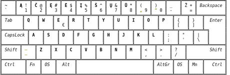
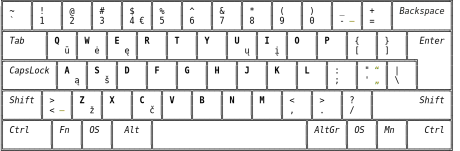

# Lietuviškų klaviatūros išdėstymų palyginimas

Išdėstymai rikiuojami pagal [lietuviško teksto patikrose](lt-isdestymu-patikros.md) surinktų skaičių sumos didumą.

+ Duodamas po išdėstymo paveikslėliu _NP_ (našumas-patogumas, ergonomiškumas) išreikštas nuošimčiais, lyginant išdėstymų surinktų taškų sumą su geriausiai pasirodžiusiojo išdėstymo (Ratisės) taškų suma, nuošimtis su priešdėliu _L_ rodo skaičiavimą tik lietuviškam tekstui, nuošimtis su priešdėliu _E_ — tik angliškam, su _P_ — tik programavimo tekstui.

 

  __1. [ŪĖYOQJ Ratisė](https://albuck.github.io/Ratise-layout/) (ISO):__
   
       NP — L100% E100% P100%

  __2. [ĖOŪYHJ Remigijaus](https://web.archive.org/web/20080315055411/http://pradmenes.net/tekstu_katalogas/remigijus/klaviatura.html) (ISO):__
   
       NP — L93% E91% P93%

  __3. [QGRLDČ Lekp](https://lekp.info/) (ISO):__
   
       NP — L88% E97% P70%

  __4. [FZVPUJ, LST 1092-89](http://lietuvybė.lt/standartai/klaviat%C5%ABros-i%C5%A1d%C4%97stymai/) (ISO):__
   
       NP — L70% E80% P82%

  __5. [QWERTY Lithuanian](https://web.archive.org/web/20210125092522/https://www.registrucentras.lt/litwin/keyboard.html) (ISO):__
   
       NP — L70% E77% P75%

  __6. [ĄŽERTY Standard 2000](http://www.ims.mii.lt/klav/) (ISO):__
   
       NP — L70% E70% P75%

  __7. [ĄŽERTY IBM Standard 1992](https://web.archive.org/web/20210125092522/https://www.registrucentras.lt/litwin/keyboard.html) (ISO):__
   
       NP — L69% E73% P73%

  __8. [QWERTY Baltic-Numeric](https://web.archive.org/web/20210125092522/https://www.registrucentras.lt/litwin/keyboard.html) (ISO):__
   
       NP — L69% E78% P61%

  __9. [QWERTY Lithuanian Programmers](https://web.archive.org/web/20210125092522/https://www.registrucentras.lt/litwin/keyboard.html) (ISO):__
   
       NP — L68% E78% P57%

  __10. [QWERTY Baltic-Numeric Programmers](http://lietuvybė.lt/naudotojams/klaviaturos/) (ISO):__
   
       NP — L66% E78% P57%

 

+ __Lietuviškų išdėstymų NP vertinimo eilė lietuviškam tekstui:__

   1. ŪĖYOQJ Ratisė (ISO) — 100%
   2. ĖOŪYHJ Remigijaus (ISO) — 93%
   3. QGRLDČ LEKP (ISO) — 88%
   4. FZVPUJ (ISO) — 70%
   5. QWERTY Lithuanian (ISO) — 70%
   6. ĄŽERTY LT Standard 2000 (ISO) — 70%
   7. ĄŽERTY IBM, LT Standard 1992 (ISO) — 69%
   8. QWERTY Baltic-Numeric (ISO) — 69%
   9. QWERTY Lithuanian Programmers (ISO) — 68%
   10. QWERTY Baltic-Numeric Programmers (ISO) — 66%
   

+ __Lietuviškų išdėstymų NP vertinimo eilė angliškam tekstui:__

   1. ŪĖYOQJ Ratisė (ISO) — 100%
   2. QGRLDČ LEKP (ISO) — 97%
   3. ĖOŪYHJ Remigijaus (ISO) — 91%
   4. FZVPUJ (ISO) — 80%
   5. QWERTY Lithuanian Programmers (ISO) — 78%
   6. QWERTY Baltic-Numeric Programmers (ISO) — 78%
   7. QWERTY Baltic-Numeric (ISO) — 78%
   8. QWERTY Lithuanian (ISO) — 77%
   9. ĄŽERTY IBM, LT Standard 1992 (ISO) — 73%
   10. ĄŽERTY LT Standard 2000 (ISO) — 70%
   

+ __Lietuviškų išdėstymų NP vertinimo eilė programavimo tekstui:__

   1. ŪĖYOQJ Ratisė (ISO) — 100%
   2. ĖOŪYHJ Remigijaus (ISO) — 93%
   3. FZVPUJ (ISO) — 82%
   4. QWERTY Lithuanian (ISO) — 75%
   5. ĄŽERTY LT Standard 2000 (ISO) — 75%
   6. ĄŽERTY IBM, LT Standard 1992 (ISO) — 73%
   7. QGRLDČ LEKP (ISO) — 70%
   8. QWERTY Baltic-Numeric (ISO) — 61%
   9. QWERTY Lithuanian Programmers (ISO) — 57%
   10. QWERTY Baltic-Numeric Programmers (ISO) — 57%
   
 
   
__Pastabos:__
+ Pasenęs lietuviškos [spausdinimo mišinėlės išdėstymas](images/lt-spausdykle.svg) neįtrauktas į palyginimą.
+ Apleistas Ratisės išdėstymo pirmavaizdis [Lietuviška tikrinė klaviatūra](https://albuck.github.io/Ratise-layout/docs/images/sena_tikrine.png) bei jos vėlesnės ar bandomosios atmainos neįtrauktos į palyginimą.
+ Galimi lietuviški išdėstymai, padaryti iš geresnių ergonomiškų angliškų išdėstymų su lietuviškomis raidėmis trečiame lygyje, neįtraukti į palyginimą.

-----------------------------------------

[Lietuviškų klaviatūros išdėstymų patikros](lt-isdestymu-patikros.md)

[Lietuviškų klaviatūrų mygtukų spaudeliojimo dažnumai](lt-isdestymu-mygt-spaud-daznumai.md)

[Lietuviškų klaviatūros išdėstymų palyginamosios statistinės lentelės](lt-isdestymu-statistines-lenteles.md)

[Tolimesnis lietuviškos klaviatūros tobulinimas ir nauraštis](lietuviskos-klaviaturos-tobulinimas.md)
