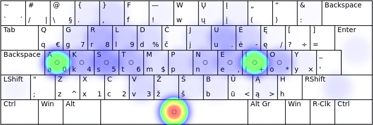
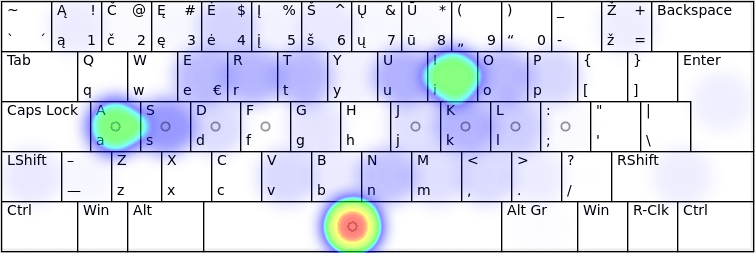

# Lietuviškų klaviatūrų mygtukų spaudeliojimo dažnumai

Išdėstymai dėstyti pagal jų pasiekimus patikrose.
Ryškesnė spalva rodo didesnį mygtuko naudojimo dažnumą.

## Lietuviškas tekstas:

Šaltinis — _Keyboard Layout Analyzer_ — Lietuviškos pasakos (iš Basanavičiaus rinkinio): [1↗](http://patorjk.com/keyboard-layout-analyzer/#/load/DLqKXSHF), [2↗](http://patorjk.com/keyboard-layout-analyzer/#/load/Qqs29kvs)

__ŪĖYOQJ Ratise (ISO):__

__ĖOŪYHJ (ISO):__

__QGRLDČ LEKP (ISO):__

__ĄŽERTY LT Standard 2000 (ISO):__

__ĄŽERTY IBM, LT Standard 1992 (ISO):__

__QWERTY Baltic-Numeric (ISO):__

__QWERTY Lithuanian (ISO):__

__QWERTY Lithuanian Programmers (ISO):__

__FZVPUJ (ISO):__

__QWERTY Baltic-Numeric Programmers (ISO):__

## Angliškas tekstas:

Šaltinis — _Keyboard Layout Analyzer_ — Alice in Wonderland, Chapter 1: [1↗](http://patorjk.com/keyboard-layout-analyzer/#/load/FJzXXpSR), [2↗](http://patorjk.com/keyboard-layout-analyzer/#/load/MM6QwmSV)

__ŪĖYOQJ Ratise (ISO):__

__QGRLDČ LEKP (ISO):__

__ĖOŪYHJ (ISO):__

__QWERTY Lithuanian Programmers (ISO):__

__QWERTY Baltic-Numeric Programmers (ISO):__

__QWERTY Baltic-Numeric (ISO):__

__QWERTY Lithuanian (ISO):__

__FZVPUJ (ISO):__

__ĄŽERTY IBM, LT Standard 1992 (ISO):__

__ĄŽERTY LT Standard 2000 (ISO):__

## Programavimo kalbų tekstas:

Šaltinis — _Keyboard Layout Analyzer_ — ‘Bash, C, CPP, HTML, JavaScript, Python’: [1↗](http://patorjk.com/keyboard-layout-analyzer/#/load/3XvH0gml), [2↗](http://patorjk.com/keyboard-layout-analyzer/#/load/NQJQCVs9)

__ŪĖYOQJ Ratise (ISO):__

__ĖOŪYHJ (ISO):__

__QGRLDČ LEKP (ISO):__

__QWERTY Lithuanian (ISO):__

__QWERTY Lithuanian Programmers (ISO):__

__QWERTY Baltic-Numeric Programmers (ISO):__

__FZVPUJ (ISO):__

__QWERTY Baltic-Numeric (ISO):__

__ĄŽERTY IBM, LT Standard 1992 (ISO):__

__ĄŽERTY LT Standard 2000 (ISO):__

-----------------------------------------

[Lietuviškų klaviatūros išdėstymų patikros](lt-isdestymu-patikros.md)

[Lietuviškų klaviatūros išdėstymų palyginamosios statistinės lentelės](lt-isdestymu-statistines-lenteles.md)

[Į pagrindinį puslapį](README.md)

